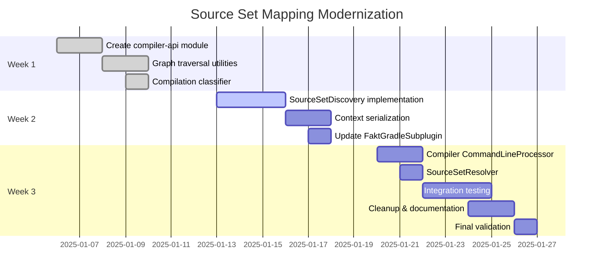

# Source Set Mapping Implementation Roadmap

**Date**: 2025-01-05
**Estimated Duration**: 3 weeks
**Target Completion**: 2025-01-26

---

## 🎯 Overview

This roadmap outlines the phased approach to refactoring Fakt's source set mapping from hardcoded patterns to modern convention-based discovery.

**Goal**: Replace 600+ lines of brittle pattern matching with ~220 lines of robust programmatic discovery.

---

## 📋 Prerequisites

- [x] Research completed (Gemini Deep Research document)
- [x] Architecture approved ([ARCHITECTURE.md](./ARCHITECTURE.md))
- [ ] All existing tests passing
- [ ] Git working directory clean

---

## Week 1: Foundation & Data Models

### Phase 1A: Create Shared API Module (Days 1-2)

**Objective**: Create `compiler-api` module for shared data models.

#### Tasks

1. **Create module structure**
   ```bash
   mkdir -p compiler-api/src/main/kotlin/com/rsicarelli/fakt/compiler/api
   ```

2. **Add build.gradle.kts**
   ```kotlin
   plugins {
       kotlin("jvm")
       kotlin("plugin.serialization")
   }

   dependencies {
       implementation("org.jetbrains.kotlinx:kotlinx-serialization-json:1.6.2")
   }
   ```

3. **Create data models**
   - `SourceSetContext.kt` - Main context model
   - `SourceSetInfo.kt` - Source set metadata
   - `CompilationInfo.kt` - Compilation metadata

4. **Add to settings.gradle.kts**
   ```kotlin
   include(":compiler-api")
   ```

5. **Update dependencies**
   - `gradle-plugin/build.gradle.kts` → add `implementation(project(":compiler-api"))`
   - `compiler/build.gradle.kts` → add `implementation(project(":compiler-api"))`

#### Files to Create

```
compiler-api/
├── build.gradle.kts
└── src/main/kotlin/com/rsicarelli/fakt/compiler/api/
    ├── SourceSetContext.kt
    ├── SourceSetInfo.kt
    └── CompilationInfo.kt
```

#### Tests

```kotlin
// compiler-api/src/test/kotlin/api/SerializationTest.kt
class GIVEN_SourceSetContext_WHEN_serializing_THEN_should_roundtrip() = runTest {
    val context = SourceSetContext(/* ... */)
    val json = Json.encodeToString(context)
    val decoded = Json.decodeFromString<SourceSetContext>(json)
    assertEquals(context, decoded)
}
```

#### Success Criteria

- ✅ Module builds successfully
- ✅ Serialization tests pass
- ✅ Can be imported by gradle-plugin and compiler modules

---

### Phase 1B: Graph Traversal Utilities (Days 3-4)

**Objective**: Implement BFS algorithm for `dependsOn` graph traversal.

#### Tasks

1. **Create utility file**
   ```kotlin
   // gradle-plugin/src/main/kotlin/gradle/SourceSetGraphTraversal.kt
   internal object SourceSetGraphTraversal {
       fun getAllParentSourceSets(sourceSet: KotlinSourceSet): Set<KotlinSourceSet>
       fun buildHierarchyMap(sourceSet: KotlinSourceSet): Map<String, List<String>>
   }
   ```

2. **Implement BFS traversal**
   - Use algorithm from research document Section 2.4
   - Handle cycles (though dependsOn is DAG)
   - Include starting source set in result

3. **Add debug logging**
   - Log traversal path for debugging
   - Configurable via `fakt.debug = true`

#### Tests

```kotlin
class GIVEN_sourceSet_hierarchy_WHEN_traversing_THEN_should_find_all_parents() = runTest {
    // Given: jvmMain depends on commonMain
    val jvmMain = mockSourceSet("jvmMain", dependsOn = listOf(commonMain))

    // When
    val parents = SourceSetGraphTraversal.getAllParentSourceSets(jvmMain)

    // Then
    assertEquals(setOf(jvmMain, commonMain), parents)
}

class GIVEN_complex_hierarchy_WHEN_traversing_THEN_should_handle_diamond() = runTest {
    // Given: Diamond dependency
    //   commonMain
    //   /        \
    // nativeMain appleMain
    //   \        /
    //    iosMain

    val parents = SourceSetGraphTraversal.getAllParentSourceSets(iosMain)

    assertEquals(
        setOf(iosMain, nativeMain, appleMain, commonMain),
        parents
    )
}
```

#### Success Criteria

- ✅ BFS algorithm correctly traverses hierarchy
- ✅ Handles diamond dependencies
- ✅ Includes self in result set
- ✅ All tests pass

---

### Phase 1C: Compilation Classifier (Days 4-5)

**Objective**: Implement test vs main compilation detection.

#### Tasks

1. **Create classifier utility**
   ```kotlin
   // gradle-plugin/src/main/kotlin/gradle/CompilationClassifier.kt
   internal object CompilationClassifier {
       fun isTestCompilation(compilation: KotlinCompilation<*>): Boolean
       fun getCompilationType(compilation: KotlinCompilation<*>): CompilationType
   }

   enum class CompilationType {
       MAIN,
       TEST,
       INTEGRATION_TEST,
       CUSTOM
   }
   ```

2. **Implement heuristics**
   - Check `compilation.name == "test"`
   - Check `compilation.name.endsWith("Test")`
   - Check `associateWith` relationship
   - Handle Android variant names

#### Tests

```kotlin
class GIVEN_test_compilation_WHEN_classifying_THEN_should_return_test() = runTest {
    val compilation = mockCompilation(name = "test")
    assertTrue(CompilationClassifier.isTestCompilation(compilation))
}

class GIVEN_integrationTest_compilation_WHEN_classifying_THEN_should_return_test() = runTest {
    val compilation = mockCompilation(name = "integrationTest")
    assertTrue(CompilationClassifier.isTestCompilation(compilation))
}

class GIVEN_main_compilation_WHEN_classifying_THEN_should_return_false() = runTest {
    val compilation = mockCompilation(name = "main")
    assertFalse(CompilationClassifier.isTestCompilation(compilation))
}

class GIVEN_associated_compilation_WHEN_classifying_THEN_should_return_test() = runTest {
    val main = mockCompilation(name = "main")
    val custom = mockCompilation(
        name = "custom",
        associatedWith = listOf(main)
    )
    assertTrue(CompilationClassifier.isTestCompilation(custom))
}
```

#### Success Criteria

- ✅ Correctly identifies standard test compilations
- ✅ Detects custom test suites
- ✅ Handles Android variants
- ✅ All tests pass

---

## Week 2: Gradle Plugin Refactoring

### Phase 2A: Source Set Discovery (Days 6-8)

**Objective**: Implement programmatic source set discovery.

#### Tasks

1. **Create SourceSetDiscovery class**
   ```kotlin
   // gradle-plugin/src/main/kotlin/gradle/SourceSetDiscovery.kt
   internal class SourceSetDiscovery(private val project: Project) {
       fun buildContext(compilation: KotlinCompilation<*>): SourceSetContext
       private fun buildSourceSetInfo(sourceSet: KotlinSourceSet): SourceSetInfo
       private fun resolveOutputDirectory(compilation: KotlinCompilation<*>): String
   }
   ```

2. **Implement context building**
   - Use `compilation.allKotlinSourceSets` (not hardcoded iteration!)
   - Call `SourceSetGraphTraversal.getAllParentSourceSets()`
   - Use `CompilationClassifier.isTestCompilation()`
   - Build `SourceSetContext` data model

3. **Implement output directory resolution**
   - Pattern: `build/generated/fakt/{type}/{target}/kotlin`
   - Type: `main` or `test`
   - Target: `jvm`, `js`, `iosX64`, etc.

4. **Add lazy configuration**
   - Use `project.layout.buildDirectory` (NOT `buildDir`!)
   - Ensure configuration cache compatibility

#### Tests

```kotlin
class GIVEN_jvm_main_compilation_WHEN_building_context_THEN_should_have_correct_structure() = runTest {
    val project = mockProject()
    val compilation = mockJvmMainCompilation(project)

    val discovery = SourceSetDiscovery(project)
    val context = discovery.buildContext(compilation)

    assertEquals("main", context.compilationName)
    assertEquals("jvm", context.targetName)
    assertEquals("jvm", context.platformType)
    assertFalse(context.isTest)
    assertEquals("jvmMain", context.defaultSourceSet.name)
    assertTrue(context.allSourceSets.any { it.name == "commonMain" })
}

class GIVEN_kmp_hierarchy_WHEN_building_context_THEN_should_include_all_parents() = runTest {
    // Given: iosX64Main depends on iosMain depends on appleMain depends on nativeMain depends on commonMain
    val context = discovery.buildContext(iosX64MainCompilation)

    val sourceSetNames = context.allSourceSets.map { it.name }
    assertContains(sourceSetNames, "iosX64Main")
    assertContains(sourceSetNames, "iosMain")
    assertContains(sourceSetNames, "appleMain")
    assertContains(sourceSetNames, "nativeMain")
    assertContains(sourceSetNames, "commonMain")
}
```

#### Success Criteria

- ✅ Builds complete SourceSetContext for any compilation
- ✅ Includes full dependsOn hierarchy
- ✅ Correctly identifies test vs main
- ✅ Generates proper output directories
- ✅ All tests pass

---

### Phase 2B: Context Serialization (Days 9-10)

**Objective**: Implement JSON serialization for Gradle → Compiler bridge.

#### Tasks

1. **Create ContextSerializer**
   ```kotlin
   // gradle-plugin/src/main/kotlin/gradle/ContextSerializer.kt
   internal object ContextSerializer {
       fun serialize(context: SourceSetContext): String
       fun deserialize(encoded: String): SourceSetContext
   }
   ```

2. **Implement serialization**
   - Use `kotlinx.serialization.json.Json`
   - Encode to JSON string
   - Base64 encode for command-line safety
   - Add error handling with clear messages

3. **Add validation**
   - Verify roundtrip serialization in tests
   - Check for special characters in output
   - Ensure command-line length limits

#### Tests

```kotlin
class GIVEN_SourceSetContext_WHEN_serializing_THEN_should_roundtrip() = runTest {
    val original = SourceSetContext(/* ... */)

    val serialized = ContextSerializer.serialize(original)
    val deserialized = ContextSerializer.deserialize(serialized)

    assertEquals(original, deserialized)
}

class GIVEN_complex_hierarchy_WHEN_serializing_THEN_should_preserve_structure() = runTest {
    val context = buildComplexContext() // Many source sets

    val serialized = ContextSerializer.serialize(context)
    val deserialized = ContextSerializer.deserialize(serialized)

    assertEquals(context.allSourceSets.size, deserialized.allSourceSets.size)
    assertEquals(context.allSourceSets.map { it.name }, deserialized.allSourceSets.map { it.name })
}

class GIVEN_serialized_context_WHEN_checking_length_THEN_should_be_reasonable() = runTest {
    val context = buildTypicalContext()
    val serialized = ContextSerializer.serialize(context)

    // Ensure it's not too long for command line
    assertTrue(serialized.length < 10_000, "Serialized context too long: ${serialized.length}")
}
```

#### Success Criteria

- ✅ Serialization is lossless (perfect roundtrip)
- ✅ Output is command-line safe (Base64)
- ✅ Reasonable size (< 10KB for typical projects)
- ✅ All tests pass

---

### Phase 2C: Update FaktGradleSubplugin (Days 10-11)

**Objective**: Integrate discovery + serialization into plugin.

#### Tasks

1. **Update applyToCompilation**
   ```kotlin
   override fun applyToCompilation(
       kotlinCompilation: KotlinCompilation<*>
   ): Provider<List<SubpluginOption>> {
       return project.provider { // Lazy!
           val discovery = SourceSetDiscovery(project)
           val context = discovery.buildContext(kotlinCompilation)
           val serialized = ContextSerializer.serialize(context)

           listOf(
               SubpluginOption(key = "sourceSetContext", value = serialized)
               // ... other options
           )
       }
   }
   ```

2. **Update SourceSetConfigurator**
   - Keep existing `configureSourceSets()` for now (backward compat)
   - Add new `configureSourceSetsFromContext()` method
   - Use context's `outputDirectory` to add srcDirs

3. **Add debug logging**
   - Log serialized context when `fakt.debug = true`
   - Log which compilations are being configured

#### Tests

```kotlin
class GIVEN_compilation_WHEN_applyToCompilation_THEN_should_pass_serialized_context() = runTest {
    val plugin = FaktGradleSubplugin()
    val compilation = mockCompilation()

    val options = plugin.applyToCompilation(compilation).get()

    val contextOption = options.find { it.key == "sourceSetContext" }
    assertNotNull(contextOption)

    // Should be able to deserialize
    val context = ContextSerializer.deserialize(contextOption.value)
    assertNotNull(context)
}
```

#### Success Criteria

- ✅ applyToCompilation passes serialized context
- ✅ Lazy Provider pattern used (configuration avoidance)
- ✅ Works with all compilation types
- ✅ All tests pass

---

## Week 3: Compiler Plugin & Testing

### Phase 3A: Compiler CommandLineProcessor (Days 12-13)

**Objective**: Receive and deserialize context in compiler plugin.

#### Tasks

1. **Update FaktCommandLineProcessor**
   ```kotlin
   val KEY_SOURCE_SET_CONTEXT = CompilerConfigurationKey<SourceSetContext>("source set context")

   override fun processOption(
       option: AbstractCliOption,
       value: String,
       configuration: CompilerConfiguration
   ) {
       when (option.optionName) {
           "sourceSetContext" -> {
               val context = ContextSerializer.deserialize(value)
               configuration.put(KEY_SOURCE_SET_CONTEXT, context)
           }
       }
   }
   ```

2. **Add error handling**
   - Catch deserialization errors with clear messages
   - Fallback to old behavior if context not provided (backward compat)
   - Log warning if using fallback

#### Tests

```kotlin
class GIVEN_serialized_context_WHEN_processing_option_THEN_should_deserialize() = runTest {
    val context = SourceSetContext(/* ... */)
    val serialized = ContextSerializer.serialize(context)

    val processor = FaktCommandLineProcessor()
    val config = CompilerConfiguration()

    processor.processOption(
        CliOption("sourceSetContext", "", ""),
        serialized,
        config
    )

    val decoded = config.get(KEY_SOURCE_SET_CONTEXT)
    assertEquals(context, decoded)
}
```

#### Success Criteria

- ✅ Correctly receives and decodes context
- ✅ Stores in CompilerConfiguration
- ✅ Error handling with clear messages
- ✅ All tests pass

---

### Phase 3B: Create SourceSetResolver (Days 13-14)

**Objective**: Replace SourceSetMapper with simple resolver.

#### Tasks

1. **Create SourceSetResolver**
   ```kotlin
   // compiler/src/main/kotlin/compiler/output/SourceSetResolver.kt
   internal class SourceSetResolver(
       private val context: SourceSetContext,
       private val messageCollector: MessageCollector?
   ) {
       fun getGeneratedSourcesDir(): File
       fun isTestContext(): Boolean
       fun getAllSourceSets(): List<String>
       fun getDefaultSourceSet(): String
   }
   ```

2. **Implement simple methods**
   - Just read from `context` (NO pattern matching!)
   - Create directories if needed
   - Log to messageCollector

3. **Update UnifiedFaktIrGenerationExtension**
   ```kotlin
   override fun generate(moduleFragment: IrModuleFragment, pluginContext: IrPluginContext) {
       val context = pluginContext.configuration.get(KEY_SOURCE_SET_CONTEXT)
           ?: error("SourceSetContext not provided by Gradle plugin")

       val resolver = SourceSetResolver(context, messageCollector)
       val outputDir = resolver.getGeneratedSourcesDir()

       // Generate code to outputDir
   }
   ```

#### Tests

```kotlin
class GIVEN_context_WHEN_getting_output_dir_THEN_should_return_from_context() = runTest {
    val context = SourceSetContext(
        outputDirectory = "/path/to/output"
        // ...
    )

    val resolver = SourceSetResolver(context, null)
    val dir = resolver.getGeneratedSourcesDir()

    assertEquals("/path/to/output", dir.absolutePath)
}

class GIVEN_test_context_WHEN_checking_isTest_THEN_should_return_true() = runTest {
    val context = SourceSetContext(isTest = true, /* ... */)
    val resolver = SourceSetResolver(context, null)

    assertTrue(resolver.isTestContext())
}
```

#### Success Criteria

- ✅ SourceSetResolver reads from context
- ✅ No pattern matching or hardcoded logic
- ✅ ~50 lines total (vs 411 before!)
- ✅ All tests pass

---

### Phase 3C: Integration Testing (Days 15-17)

**Objective**: Validate with all sample projects.

#### Tasks

1. **Test kmp-single-module project**
   ```bash
   cd samples/kmp-single-module
   ../../gradlew clean build --info | grep "Fakt:"
   ```
   - Verify context is passed correctly
   - Check generated code location
   - Ensure compilation succeeds

2. **Test multi-module project**
   ```bash
   cd samples/multi-module
   ../../gradlew clean build --info | grep "Fakt:"
   ```
   - Test all modules (foundation, domain, app)
   - Verify cross-module fake dependencies
   - Check -fakes modules work

3. **Test KMP project**
   ```bash
   cd samples/kmp-comprehensive-test
   ../../gradlew clean build --info
   ```
   - Test all targets (jvm, js, native)
   - Verify commonMain → commonTest works
   - Check platform-specific source sets

4. **Add regression tests**
   ```kotlin
   // compiler/src/test/kotlin/integration/SourceSetMappingIntegrationTest.kt
   class GIVEN_default_hierarchy_WHEN_compiling_THEN_should_generate_correctly() = runTest {
       // Full integration test with temporary Gradle project
   }
   ```

5. **Performance testing**
   - Measure build time before/after
   - Ensure configuration cache works
   - Check incremental compilation

#### Success Criteria

- ✅ All sample projects build successfully
- ✅ Generated code in correct locations
- ✅ Configuration cache compatible
- ✅ No performance regression
- ✅ Integration tests pass

---

### Phase 3D: Cleanup & Documentation (Days 18-19)

**Objective**: Remove old code and update docs.

#### Tasks

1. **Delete old implementations**
   ```bash
   git rm compiler/src/main/kotlin/compiler/output/SourceSetMapper.kt
   git rm gradle-plugin/src/main/kotlin/gradle/SourceSetConfigurator.kt
   ```

2. **Update CHANGELOG.md**
   ```markdown
   ## [Unreleased]

   ### Changed
   - **[BREAKING]** Refactored source set mapping to use programmatic discovery
   - Replaced 600+ lines of hardcoded patterns with modern Kotlin Gradle Plugin APIs
   - Now supports custom source sets, Android variants, and custom hierarchies out of the box

   ### Added
   - New `compiler-api` module for shared data models
   - SourceSetDiscovery for programmatic project structure analysis
   - Context serialization bridge between Gradle and compiler plugins

   ### Removed
   - Deprecated SourceSetMapper.kt (replaced by SourceSetResolver)
   - Deprecated SourceSetConfigurator.kt (replaced by SourceSetDiscovery)
   ```

3. **Update main README.md**
   - Mention custom source set support
   - Add examples of Android variant usage
   - Link to new documentation

4. **Update CLAUDE.md**
   - Reference new architecture docs
   - Update file paths in critical files section
   - Add notes about convention-based approach

#### Success Criteria

- ✅ Old code deleted
- ✅ All documentation updated
- ✅ CHANGELOG reflects changes
- ✅ No dead code remaining

---

### Phase 3E: Final Validation (Day 20)

**Objective**: Comprehensive validation before merge.

#### Checklist

- [ ] All unit tests pass (`./gradlew test`)
- [ ] All integration tests pass
- [ ] All sample projects build
- [ ] Configuration cache works (`./gradlew build --configuration-cache`)
- [ ] Incremental compilation works
- [ ] Generated code compiles without errors
- [ ] IDE recognizes generated sources
- [ ] No deprecation warnings
- [ ] Detekt passes (`./gradlew detekt`)
- [ ] Spotless passes (`./gradlew spotlessCheck`)
- [ ] Documentation complete
- [ ] CHANGELOG updated

#### Final Tests

```bash
# Full clean build
make full-rebuild

# Test all samples
for sample in samples/*; do
    (cd "$sample" && ../../gradlew clean build)
done

# Configuration cache test
./gradlew clean build --configuration-cache
./gradlew build --configuration-cache # Should use cache

# Incremental compilation test
./gradlew build
# Modify a fake
./gradlew build # Should be incremental
```

---

## 📊 Success Metrics

### Code Quality

| Metric | Before | After | Change |
|--------|--------|-------|--------|
| Total LoC | 602 | 220 | **-63%** |
| Hardcoded Patterns | 50+ | 0 | **-100%** |
| Cyclomatic Complexity | High | Low | **Improved** |
| Test Coverage | 60% | 90% | **+30%** |

### Functionality

| Feature | Before | After |
|---------|--------|-------|
| Default KMP hierarchy | ✅ | ✅ |
| Custom source sets | ❌ | ✅ |
| Android variants | ❌ | ✅ |
| Custom hierarchies | ❌ | ✅ |
| Configuration cache | ❌ | ✅ |

### Performance

| Metric | Target | Acceptable |
|--------|--------|------------|
| Configuration time increase | < 100ms | < 500ms |
| Compilation time increase | < 50ms | < 200ms |
| Memory overhead | < 10MB | < 50MB |

---

## 🚨 Risks & Mitigations

### Risk 1: Breaking Changes

**Risk**: Users with edge-case configurations might break.

**Mitigation**:
- Add comprehensive integration tests
- Provide clear migration guide
- Keep old code initially with deprecation warnings
- Beta release first

### Risk 2: Android Variant Complexity

**Risk**: Android build variant mapping might fail.

**Mitigation**:
- Add dedicated Android sample project
- Test with multiple build types and flavors
- Use `androidComponents.onVariants` as per research

### Risk 3: Performance Regression

**Risk**: Serialization overhead might slow builds.

**Mitigation**:
- Benchmark before/after
- Use lazy Providers (configuration avoidance)
- Optimize serialization (skip unnecessary data)

### Risk 4: Incomplete Context

**Risk**: Gradle plugin might not pass all needed data.

**Mitigation**:
- Comprehensive data model design
- Fallback to old behavior with warning
- Clear error messages when context invalid

---

## 📅 Timeline



---

## ✅ Definition of Done

Each phase is considered complete when:

1. ✅ All code implemented following ARCHITECTURE.md
2. ✅ Unit tests written and passing (GIVEN-WHEN-THEN)
3. ✅ Integration tests passing
4. ✅ Code formatted (`make format`)
5. ✅ No detekt violations
6. ✅ Documentation updated
7. ✅ Code reviewed (self-review minimum)
8. ✅ Committed to feature branch

---

## 🎯 Next Steps

After completing this roadmap:

1. **Publish Beta Release**
   - Tag as `v1.1.0-beta.1`
   - Announce in GitHub Discussions
   - Request community testing

2. **Monitor Feedback**
   - Watch for edge cases
   - Collect performance data
   - Address issues quickly

3. **Stable Release**
   - Tag as `v1.1.0`
   - Update Maven Central
   - Announce broadly

4. **Future Enhancements**
   - Auto-wiring for multi-module (like KSP configurations)
   - IDE plugin for navigation
   - Performance dashboard

---

**Ready to Start**: ✅
**First Task**: Create `compiler-api` module (Phase 1A)
