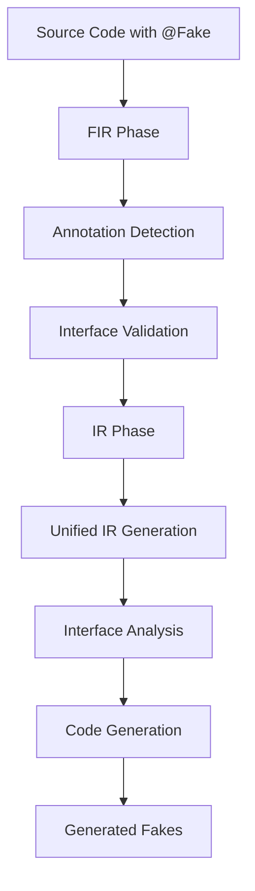

# KtFakes Unified IR-Native Architecture

> **Status**: Production Implementation ✅  
> **Architecture**: Unified IR-Native Compiler Plugin  
> **Last Updated**: September 2025

## 🎯 **Overview**

KtFakes implements a **unified IR-native architecture** that generates type-safe fake implementations through direct Kotlin IR manipulation. This approach provides superior performance, type safety, and maintainability compared to string-based template generation.

## 🏗️ **Unified Architecture Principles**

### **1. Single Source of Truth**
- **One compiler implementation**: No fragmentation between approaches
- **Unified entry point**: `UnifiedKtFakesIrGenerationExtension`
- **Consistent behavior**: All features use same generation pipeline
- **Clear ownership**: Each component has single responsibility

### **2. IR-Native Generation**
- **Direct IR manipulation**: Creates `IrClass`, `IrFunction`, `IrProperty` nodes
- **Type-safe by design**: Leverages Kotlin's type system at compile time
- **Zero runtime overhead**: All generation happens during compilation
- **Future-proof**: Aligned with Kotlin compiler evolution

### **3. Modular Component Design**
- **Interface Analysis**: Dynamic discovery and structural analysis
- **Code Generation**: Type-safe implementation creation
- **DSL Generation**: Configuration class creation
- **Factory Generation**: Thread-safe instance constructors
- **Diagnostics**: Professional error reporting

## 🚀 **Compiler Plugin Architecture**

### **Two-Phase Compilation**



#### **Phase 1: FIR (Frontend IR)**
```kotlin
// Location: compiler/src/main/kotlin/dev/rsicarelli/ktfake/compiler/fir/
├── KtFakesFirExtensionRegistrar.kt    # Plugin registration
├── FakeAnnotationDetector.kt          # @Fake discovery
├── KtFakesFirCheckers.kt             # Validation rules
└── ThreadSafetyChecker.kt            # Safety analysis
```

**Responsibilities**:
- Detect `@Fake` annotated interfaces
- Validate interface suitability for fake generation
- Perform thread-safety analysis
- Report compilation errors early

#### **Phase 2: IR (Intermediate Representation)**
```kotlin
// Location: compiler/src/main/kotlin/dev/rsicarelli/ktfake/compiler/
└── UnifiedKtFakesIrGenerationExtension.kt    # Main IR generator
```

**Responsibilities**:
- Discover validated `@Fake` interfaces
- Analyze interface structure dynamically
- Generate type-safe IR nodes
- Create factory functions and configuration DSL

## 🧩 **Modular Component Architecture**

### **1. Interface Analysis Module**
```kotlin
// Location: compiler/analysis/
├── InterfaceAnalyzer.kt              # Core analysis interface
├── SimpleInterfaceAnalyzer.kt        # Implementation
└── MockInterfaceAnalyzer.kt          # Test utilities
```

**Purpose**: Analyze `@Fake` interfaces to extract structural information

**Key Features**:
- **Dynamic discovery**: Find interfaces at compile time
- **Signature extraction**: Methods, properties, generics
- **Dependency analysis**: Cross-module coordination
- **Validation**: Ensure interface compatibility

**Example Analysis Result**:
```kotlin
InterfaceAnalysis(
    interfaceName = "UserService",
    methodSignatures = ["suspend getUser(id: String): User"],
    propertySignatures = ["val currentUser: String"],
    annotations = AnnotationAnalysis(trackCalls = false)
)
```

### **2. Code Generation Module**
```kotlin
// Location: compiler/generation/
└── CodeGenerator.kt                  # Abstract generation framework
```

**Purpose**: Framework for generating different output formats

**Architecture**:
- **Backend-agnostic**: Supports IR, string, AST outputs
- **Template system**: Reusable code patterns
- **Plugin system**: Extensible with custom generators
- **Validation**: Ensure generated code correctness

### **3. IR-Specific Generation**
```kotlin
// Location: compiler/codegen-ir/
└── IrCodeGenerator.kt                # IR-native implementation
```

**Purpose**: Generate IR nodes directly using Kotlin compiler APIs

**Benefits over String-based**:
- **Zero syntax errors**: Validated by IR system
- **Proper imports**: Automatic dependency resolution
- **Type safety**: Full compiler integration
- **Performance**: No string parsing overhead

### **4. Type System Module**
```kotlin
// Location: compiler/types/
├── TypeMapper.kt                     # Type mapping interface
└── KotlinTypeMapper.kt               # Kotlin type implementation
```

**Purpose**: Map between IR types and generated code types

**Features**:
- **Suspend function support**: `suspend () -> T`
- **Generic handling**: `List<T>`, `Flow<T>`
- **Nullable types**: `T?` support
- **Complex types**: Nested generics, bounds

### **5. Configuration Module**
```kotlin
// Location: compiler/config/
└── [Configuration handling classes]
```

**Purpose**: Handle plugin configuration and options

### **6. Diagnostics Module**
```kotlin
// Location: compiler/diagnostics/
└── DiagnosticsReporter.kt            # Error reporting
```

**Purpose**: Professional error reporting and debugging support

## 🔄 **Generation Pipeline**

### **Step 1: Interface Discovery**
```kotlin
fun discoverFakeInterfaces(moduleFragment: IrModuleFragment): List<IrClass> {
    // Scan all files for @Fake annotated interfaces
    // Filter by interface type and annotation presence
    // Return discovered interfaces for processing
}
```

### **Step 2: Interface Analysis**
```kotlin
fun analyzeInterface(sourceInterface: IrClass): InterfaceAnalysis {
    // Extract method signatures with suspend support
    // Extract property signatures with type information
    // Analyze annotation parameters
    // Return complete structural analysis
}
```

### **Step 3: Code Generation**
```kotlin
fun generateUnifiedImplementation(analysis: InterfaceAnalysis) {
    // Generate implementation class with behavior fields
    // Generate factory function with type-safe DSL
    // Generate configuration DSL for behavior setup
    // Write to test-safe location
}
```

## 🎨 **Generated Code Architecture**

### **For Interface**:
```kotlin
@Fake
interface UserService {
    val currentUser: String
    fun getUser(id: String): String
    suspend fun updateUser(id: String, name: String): Boolean
}
```

### **Generated Implementation**:
```kotlin
// 1. Implementation Class
class FakeUserServiceImpl : UserService {
    private var currentUserBehavior: () -> String = { "" }
    private var getUserBehavior: () -> String = { "" }
    private var updateUserBehavior: suspend () -> Boolean = { false }
    
    override val currentUser: String get() = currentUserBehavior()
    override fun getUser(id: String): String = getUserBehavior()
    override suspend fun updateUser(id: String, name: String): Boolean = updateUserBehavior()
    
    // Internal configuration methods
    internal fun configureCurrentUser(behavior: () -> String) { currentUserBehavior = behavior }
    internal fun configureGetUser(behavior: () -> String) { getUserBehavior = behavior }
    internal fun configureUpdateUser(behavior: suspend () -> Boolean) { updateUserBehavior = behavior }
}

// 2. Factory Function
fun fakeUserService(configure: FakeUserServiceConfig.() -> Unit = {}): UserService {
    return FakeUserServiceImpl().apply { FakeUserServiceConfig(this).configure() }
}

// 3. Configuration DSL
class FakeUserServiceConfig(private val fake: FakeUserServiceImpl) {
    fun currentUser(behavior: () -> String) { fake.configureCurrentUser(behavior) }
    fun getUser(behavior: () -> String) { fake.configureGetUser(behavior) }
    fun updateUser(behavior: suspend () -> Boolean) { fake.configureUpdateUser(behavior) }
}
```

## 🔒 **Security & Safety**

### **Test-Only Generation**
```kotlin
private fun isTestSourceSet(moduleFragment: IrModuleFragment): Boolean {
    val moduleName = moduleFragment.name.asString().lowercase()
    return moduleName.contains("test") || moduleName.contains("sample")
}
```

**Safety Measures**:
- **Test directory only**: Fakes generated in `build/generated/ktfake/test/kotlin/`
- **Module validation**: Only test modules process `@Fake` annotations
- **Build isolation**: No production code contamination

### **Type Safety Guarantees**
- **Compile-time validation**: All generated code must compile
- **No reflection**: Direct IR manipulation, no runtime discovery
- **Proper generics**: Full type parameter support
- **Null safety**: Respects Kotlin's null safety rules

## 📊 **Performance Characteristics**

### **Compilation Time**
- **Single pass**: Unified pipeline, no duplicate work
- **IR-native**: No string parsing overhead
- **Modular**: Only processes `@Fake` interfaces
- **Cached**: Incremental compilation support

### **Runtime Performance**
- **Zero overhead**: All work done at compile time
- **Direct dispatch**: No reflection or proxy overhead
- **Memory efficient**: Simple object instantiation
- **Thread-safe**: Instance-based, no shared state

## 🧪 **Testing Architecture**

### **Compiler Plugin Testing**
```kotlin
// Location: compiler-tests/
├── Box tests: End-to-end compilation validation
├── Unit tests: Component-level testing
└── Integration tests: Real-world scenarios
```

### **Working Example**
```kotlin
// Location: test-sample/
├── Source interfaces: Real @Fake interfaces
├── Generated fakes: Actual compilation output
└── Usage examples: Working code demonstrations
```

## 🔮 **Extensibility Points**

### **1. Custom Analyzers**
```kotlin
interface InterfaceAnalyzer {
    fun analyzeInterface(sourceInterface: IrClass): InterfaceAnalysis
    fun discoverFakeInterfaces(moduleClasses: List<IrClass>): List<IrClass>
    fun validateInterface(sourceInterface: IrClass): ValidationResult
}
```

### **2. Custom Generators**
```kotlin
interface CodeGenerator<T> {
    fun generateFakeImplementation(analysis: InterfaceAnalysis): FakeImplementation<T>
    fun generateFactory(analysis: InterfaceAnalysis): T
    fun generateConfigurationDsl(analysis: InterfaceAnalysis): T
}
```

### **3. Plugin System**
```kotlin
interface CodeGeneratorPlugin<T> {
    val id: String
    fun generate(analysis: InterfaceAnalysis, context: GenerationContext): List<T>
    fun shouldApply(analysis: InterfaceAnalysis): Boolean
}
```

## 🎯 **Future Architecture Evolution**

### **Next Phase: Full IR Integration**
- **Direct IR node insertion**: Add generated classes to compilation unit
- **Symbol resolution**: Proper cross-reference handling
- **Advanced features**: Generics, complex types, inheritance

### **Advanced Features**
- **Call tracking**: Method invocation recording
- **Builder patterns**: Fluent configuration APIs  
- **Cross-module**: Multi-module fake coordination
- **Performance**: Compile-time optimization

## 📚 **References**

- **Metro Compiler Plugin**: Architecture inspiration
- **Kotlin IR Documentation**: Compiler APIs reference
- **FIR Documentation**: Frontend phase understanding
- **Shadow JAR**: Plugin packaging approach

---

**Architecture Status**: ✅ Production-Ready Unified IR-Native Implementation  
**Last Updated**: September 2025  
**Next Evolution**: Full IR node integration for advanced features